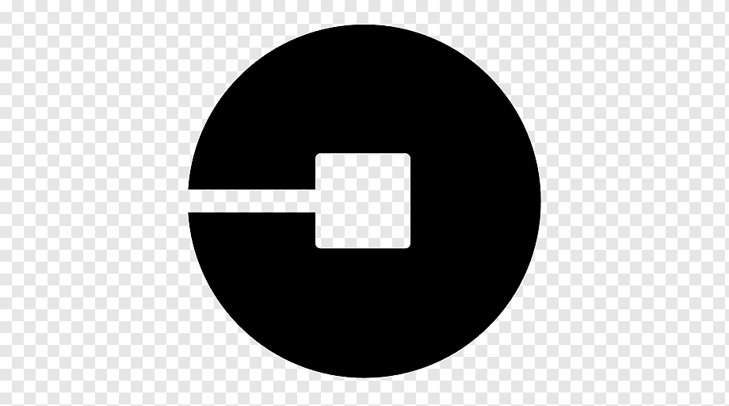

### Hi there! I'm Bryan Xu.

## I'm a third year computer science major at UC Santa Barbara!

- I’m currently learning HTML and CSS 📖
- Seeking internships in software development! 🌱
- 2021 Goals: Learn more about web development 💪
- Fun fact: I love to read light novels, play Guzheng, and listen to music in my free time 🎵
- President/Founder of UCSB Badminton Club, Secretary of UCSB Taiwanese American Students Association, and Undergraduate Learning Assistant for CMPSC16 at UCSB 🎓

### Connect with me:

 <!---  [][website]--->
[][linkedin]
[][instagram]

 

### Languages and Tools:

C++  

Java  

JavaScript  

C  

Python  

R  

SQL  

MIPS Assembly Language  

Spring Boot  

React  

LaTeX  

Git  

GitHub  

Heroku  

VS Code  

CI/CD systems  

Adobe Illustrator  

Adobe Indesign  

Adobe Photoshop  

Microsoft Office  

 
 

  

[website]: https://codeSTACKr.com
[instagram]: https://instagram.com/XuperBryan
[linkedin]: https://linkedin.com/in/bryan-bx-xu
